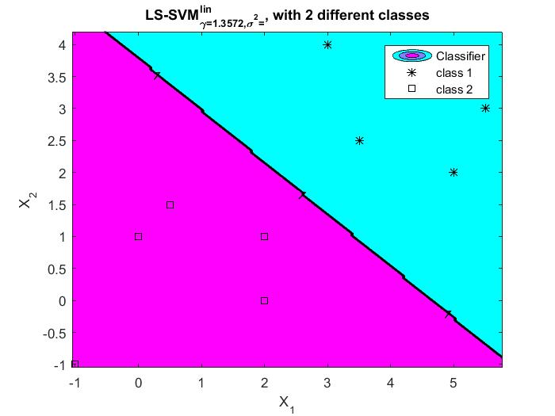

# Machine Learning - Homework 3


## Eric Stevens

This assignment was written in MATLAB R2015b.


# Problem 1: Perceptron


## Description

This program was written in two parts:


1. **perceptron.m **- This function file takes the raw input data as two seperate classes and returns the ramdomized initializatio of the weight vector, **W_init**, as well as the final learned weights **W**. The function file also has a helper function, **converged()**, that is handed a labeled and biased matrix and a weight vector and tests if the data is properly classified based on the input weight vector. It returns a boolean, **has_converged**, which is true iff all data points are properly classified and otherwise returns false. 
2. **problem1.m** - This is a very simple script that manually declares the data in their respective classes and then calls the functions detailed above. 


## Question Answers:


1. **Is that linearly separable? **Yes, we can clearly visualize drawing a line that properly segregates the classes. Furthermore, the fact that we were able to write a linear perceptron learning algorithm that converges implies that the data is linearly seperable.
2. **Does the final decision boundary separate all data points correctly? **Yes, we can clearly see that in each of the examples below that a solution that completly seperates that data was achieved.
3. ** How many iterations does it take to converge? **This depends on both the definition of _iterations_ and the random initialization of the weight vector. For my purposes, I have defined iterations as the number of times that the weight vector _W_ is updated. Using this definition, there is still no set number of iterations that it is guaranteed to take. This is because the assignment instructs us to randomly initialize the weight vector. In the examples below **Example 1** converges after just 1 update to the weight vector while **Example 2** takes 18 iterations to converge.


## Results


### W = [ Threshold,    W1 (x axis),    W2 (y axis) ]


### **Example Run 1:**


### W_init = [ 0.8147,    0.9058,    0.1270 ]


<p id="gdcalert1" ><span style="color: red; font-weight: bold">>>>>>  gd2md-html alert: inline image link here (to images/ML-Homework30.jpg). Store image on your image server and adjust path/filename if necessary. </span><br>(<a href="#">Back to top</a>)(<a href="#gdcalert2">Next alert</a>)<br><span style="color: red; font-weight: bold">>>>>> </span></p>


### Training Stage


<p id="gdcalert2" ><span style="color: red; font-weight: bold">>>>>>  gd2md-html alert: inline image link here (to images/ML-Homework31.jpg). Store image on your image server and adjust path/filename if necessary. </span><br>(<a href="#">Back to top</a>)(<a href="#gdcalert3">Next alert</a>)<br><span style="color: red; font-weight: bold">>>>>> </span></p>


### W_learned = [ 1.8147,   -0.0942,   -0.8730 ]


<p id="gdcalert3" ><span style="color: red; font-weight: bold">>>>>>  gd2md-html alert: inline image link here (to images/ML-Homework32.jpg). Store image on your image server and adjust path/filename if necessary. </span><br>(<a href="#">Back to top</a>)(<a href="#gdcalert4">Next alert</a>)<br><span style="color: red; font-weight: bold">>>>>> </span></p>


### **Example Run 2:**


### W_init = [ 0.9743,    0.3560,    0.3253 ]


<p id="gdcalert4" ><span style="color: red; font-weight: bold">>>>>>  gd2md-html alert: inline image link here (to images/ML-Homework33.jpg). Store image on your image server and adjust path/filename if necessary. </span><br>(<a href="#">Back to top</a>)(<a href="#gdcalert5">Next alert</a>)<br><span style="color: red; font-weight: bold">>>>>> </span></p>


### Training Stage


<p id="gdcalert5" ><span style="color: red; font-weight: bold">>>>>>  gd2md-html alert: inline image link here (to images/ML-Homework34.jpg). Store image on your image server and adjust path/filename if necessary. </span><br>(<a href="#">Back to top</a>)(<a href="#gdcalert6">Next alert</a>)<br><span style="color: red; font-weight: bold">>>>>> </span></p>


### W_learned = [ 7.9743,   -0.6440,   -4.6747]


<p id="gdcalert6" ><span style="color: red; font-weight: bold">>>>>>  gd2md-html alert: inline image link here (to images/ML-Homework35.jpg). Store image on your image server and adjust path/filename if necessary. </span><br>(<a href="#">Back to top</a>)(<a href="#gdcalert7">Next alert</a>)<br><span style="color: red; font-weight: bold">>>>>> </span></p>


## Source


### **perceptron.m:**


```
% This function will take an input of two
% datasets where X1 is class 1 and X2 is
% class 2. X1 and X2 must have the same 
% number of columns. It will then perform 
% the perceptron learning algorithm. The
% function will return the final weights
% as well as the random initial weights.
function [W, Winit] = perceptron(X1, X2)

    moves = 0;
    % Create seperate and combined class matricies
    % by adding bias in column one and y in column 4
    C1 = [ones(size(X1,1),1), X1, ones(size(X1,1),1)]
    C2 = [ones(size(X2,1),1), X2, -1*ones(size(X2,1),1)]
    C = [C1;C2]
    
    % get the dimentionality of the training data
    dim = size(C,2)-1;
    
    % initialize random weights
    W = rand(1, dim);
    Winit = W; % store initial
        figure
    hold on
    scatter(C1(:,2)', C1(:,3)', 'filled', 'r');
    scatter(C2(:,2)', C2(:,3)', 'filled', 'b');
    xax = floor(min(C(:,2)))-1: ceil(max(C(:,2)))+1;
    plot(xax, -(W(2)/W(3))*xax - (W(1)/W(3)));
    hold off
    
    
    % initialize plots with class colored data points
    % as well as a line reflecting the initial weights
    figure
    hold on
    scatter(C1(:,2)', C1(:,3)', 'filled', 'r');
    scatter(C2(:,2)', C2(:,3)', 'filled', 'b');
    xax = floor(min(C(:,2)))-1: ceil(max(C(:,2)))+1;
    plot(xax, -(W(2)/W(3))*xax - (W(1)/W(3)));
    
    % while learning has not converged
    while ~converged(C,W) % helper, see below
        
        % for every point in the dataset
        for i = 1:size(C,1);
            
            % calculate y hat
            y = C(i,dim+1);
            y_hat = y*(W*C(i,1:dim)');

            % update weights
            lrn_rate =  1;
            if y_hat < 0
                moves = moves+1;
                W = W+(y*lrn_rate)*C(i,1:dim);

                % plot at each weight update
                plot(xax, -(W(2)/W(3))*xax - (W(1)/W(3)));
            end
        end
    end

    hold off
    
    figure
    hold on
    scatter(C1(:,2)', C1(:,3)', 'filled', 'r');
    scatter(C2(:,2)', C2(:,3)', 'filled', 'b');
    plot(xax, -(W(2)/W(3))*xax - (W(1)/W(3)));
    hold off
    
    moves
end

% This is a helper function for the perceptron
% function. Handed a data set that includes 
% binary lables in the last column, it will
% return true if all labels are classifiec 
% correctly and false if they are not.
function has_converged = converged(C,W)

    % for every data point in set
    for i = 1:size(C,1)
        dim = size(C,2); 
        y = C(i,dim);
        y_hat = y*(W*C(i,1:dim-1)');
        % if missclassification
        if y_hat <0;
            has_converged = false;
            return
        end
    end
    % if no missclassification occoured
    has_converged = true;
end
```


### **problem1.m:**


```
%% Problem 1

% enter the data manually
class1 = [-1 -1; 2 0; 2 1; 0 1; 0.5 1.5];
class2 = [3.5 2.5; 3 4; 5 2; 5.5 3];

% run perceptron learning algorithm on data
[W, Winit] = perceptron(class1, class2)

% calculate slope an intercept (class2 is y axis)
slope = -W(2)/W(3)
intercept = -W(1)/W(3)
```


# Problem 2: Support Vector Machine


## Description

Most of the work of this problem is done by the provided functions. The script here simply accomplishes the few tasks that were required in the project description.


## Results

For the provided training and testing split the results are as follows:


```
training_size = 539
train_accuracy = 0.7681
train_error = 0.2319
train_confusion_matrix =
   299    40
    85   115


testing_size = 229
test_accuracy = 0.8035
test_error = 0.1965
test_confusion_matrix =

   142    19
    26    42
```


These results seemed strange to me since there appears to be a higher performance on the testing data than the training data. I decided to ignore the test train split provided and make my own by shuffling the data. 

When shuffling the data and keeping the same size test train split, there appeared to be about a 50% chance that the testing error would be lower than the training error. I then proceeded to make a 9:1 test train split. Doing this there is a much higher likelihood that the training error is less than the testing error. Even with the 90:10 split there were still many appearances of the test data having lower error rates than the training data and I am curious as to why this is.

The code that accomplishes the shuffling and re-splitting of the data is included in the script. 


## Source


### **problem2.m**


```
%%% Problem 2: SVM

%% load data from .txt files
training_data = dlmread('pima_train.txt');
testing_data = dlmread('pima_test.txt');

%% shuffle data and adjust split
data = [training_data; testing_data] % combine data
[r, c] = size(data) 
shuf_data = data % new matrix of same size
idx=randperm(r) % random permutation array
for i=1:r 
    shuf_data(i,:)=data(idx(i),:); % shuffle data
end
% create new tt split
training_data = shuf_data(1:690,:);
testing_data = shuf_data(691:r,:);

%% training
X = training_data(:,1:8);
Y_in = training_data(:,9);
cost = 1.0;
[W,b] = svml(X,Y_in,cost);

%% get model performance on training data
% get y and y_hat
Y_test = training_data(:,9);
Y_hat = double(training_data(:,1:8)*W+b >0);
%training data size
training_size = size(training_data)
% calculate accuracy
train_accuracy = sum(Y_hat(:,1) == Y_test)/size(Y_test,1)
% classification error
train_error = 1-train_accuracy
% build confusion matrix
train_confusion_matrix = [~Y_hat'*double(~Y_test), Y_hat'*~Y_test;
                    ~Y_hat'*Y_test, Y_hat'*Y_test]
                

%% get model performance on testing data
% get y and y_hat
Y_test = testing_data(:,9);
Y_hat = double(testing_data(:,1:8)*W+b >0);
% test data size
testing_size=size(testing_data)
% calculate accuracy
test_accuracy = sum(Y_hat(:,1) == Y_test)/size(Y_test,1)

% classification error
test_error = 1-test_accuracy

% build confusion matrix
test_confusion_matrix = [~Y_hat'*double(~Y_test), Y_hat'*~Y_test;
                    ~Y_hat'*Y_test, Y_hat'*Y_test]
                
```


# Optional

This section was done with the use of the **LS-SVM Lab** open source software which can be can be accessed here: [https://www.esat.kuleuven.be/sista/lssvmlab/](https://www.esat.kuleuven.be/sista/lssvmlab/)


### Problem 1: Do I know how to work this?

Applying the library to the data from problem two did not seem to be a feasible starting point since the data was higher dimensional than I would be able to visualize, and therefore have a difficult time seeing if I was using the library properly. So I decided to start applying multiple SVM models to the first problem. 


### Source


```
%% Problem 1 with SVM

% enter the data manually
class1 = [-1 -1; 2 0; 2 1; 0 1; 0.5 1.5];
class2 = [3.5 2.5; 3 4; 5 2; 5.5 3];

XY = [[class1, ones(size(class1,1),1)];
    [class2, -ones(size(class2,1),1)]];

X = XY(:,1:2)
Y = XY(:,3)

%% auto tune linear model
type = 'classification';
L_fold = 10; % L-fold crossvalidation
model = initlssvm(X,Y,type,[],[],'lin_kernel');
model = tunelssvm(model,'simplex','crossvalidatelssvm',{L_fold,'misclass'});
model = trainlssvm(model);
plotlssvm(model);

%% auto tune polynomial model
type = 'classification';
L_fold = 10; % L-fold crossvalidation
model = initlssvm(X,Y,type,[],[],'poly_kernel');
model = tunelssvm(model,'simplex','crossvalidatelssvm',{L_fold,'misclass'});
model = trainlssvm(model);
plotlssvm(model);

```


### Results


#### Linear Kernel


<p id="gdcalert7" ><span style="color: red; font-weight: bold">>>>>>  gd2md-html alert: inline image link here (to images/ML-Homework36.jpg). Store image on your image server and adjust path/filename if necessary. </span><br>(<a href="#">Back to top</a>)(<a href="#gdcalert8">Next alert</a>)<br><span style="color: red; font-weight: bold">>>>>> </span></p>





#### Polynomial Kernel


<p id="gdcalert8" ><span style="color: red; font-weight: bold">>>>>>  gd2md-html alert: inline image link here (to images/ML-Homework37.jpg). Store image on your image server and adjust path/filename if necessary. </span><br>(<a href="#">Back to top</a>)(<a href="#gdcalert9">Next alert</a>)<br><span style="color: red; font-weight: bold">>>>>> </span></p>


So we see that the library is functioning properly and handling the learning of both weight vectors as well as hyper parameters, like polynomial order, on its own by leveraging k-fold cross-validation. We can now move on to using the Problem 2.


### Problem 2: No Visuals

In this section we will not be able to visually analyze how the model learns since the dimensionality of the data is too high. We will therefore rely only on the testing performance on the data, as we did in problem 2 of the main assignment.


#### Load Data


```
% Download package at: https://www.esat.kuleuven.be/sista/lssvmlab/

% load data from .txt files
training_data = dlmread('pima_train.txt');
testing_data = dlmread('pima_test.txt');

% training data
X = training_data(:,1:8);
Y = 2*training_data(:,9) - 1;

% testing data
Xt = testing_data(:,1:8);
Yt = 2*testing_data(:,9) - 1;
Yt = (Yt+1)/2;
```


#### Linear Kernel


<table>
  <tr>
  </tr>
</table>


```
%% auto tune linear model
type = 'classification';
L_fold = 10; % L-fold crossvalidation
model = initlssvm(X,Y,type,[],[],'lin_kernel');
model = tunelssvm(model,'simplex','crossvalidatelssvm',{L_fold,'misclass'});
model = trainlssvm(model);

% calculate training performance
Y_hat = simlssvm(model,X);
Y_hat = (Y_hat+1)/2;
train_accuracy = sum(Y_hat(:,1) == ((Y+1)/2)) /size(Y,1)
train_error = 1-train_accuracy
train_confusion_matrix = [~Y_hat'*double(~((Y+1)/2)), Y_hat'*~((Y+1)/2);
                    ~Y_hat'*((Y+1)/2), Y_hat'*((Y+1)/2)]

% calculate testing performance
Y_hat = simlssvm(model,Xt);
Y_hat = (Y_hat+1)/2;
test_accuracy = sum(Y_hat(:,1) == Yt)/size(Yt,1)
test_error = 1-test_accuracy
test_confusion_matrix = [~Y_hat'*double(~Yt), Y_hat'*~Yt;
                    ~Y_hat'*Yt, Y_hat'*Yt]

```


#### Linear Results


```
train_accuracy = 0.7662
train_error = 0.2338
train_confusion_matrix =
   301    38
    88   112
test_accuracy = 0.7860
test_error = 0.2140
test_confusion_matrix =
   143    18
    31    37
```


#### Polynomial Kernel


```
%% auto tune polinomial model
type = 'classification';
L_fold = 10; % L-fold crossvalidation
model = initlssvm(X,Y,type,[],[],'poly_kernel');
model = tunelssvm(model,'simplex','crossvalidatelssvm',{L_fold,'misclass'});
model = trainlssvm(model);

% calculate training performance
Y_hat = simlssvm(model,X);
Y_hat = (Y_hat+1)/2;
train_accuracy = sum(Y_hat(:,1) == ((Y+1)/2)) /size(Y,1)
train_error = 1-train_accuracy
train_confusion_matrix = [~Y_hat'*double(~((Y+1)/2)), Y_hat'*~((Y+1)/2);
                    ~Y_hat'*((Y+1)/2), Y_hat'*((Y+1)/2)]

% calculate testing performance
Y_hat = simlssvm(model,Xt);
Y_hat = (Y_hat+1)/2;
test_accuracy = sum(Y_hat(:,1) == Yt)/size(Yt,1)
test_error = 1-test_accuracy
test_confusion_matrix = [~Y_hat'*double(~Yt), Y_hat'*~Yt;
                    ~Y_hat'*Yt, Y_hat'*Yt]
```


#### Polynomial Results


```
train_accuracy = 0.8571
train_error = 0.1429
train_confusion_matrix =

   308    31
    46   154

test_accuracy = 0.7205
test_error = 0.2795
test_confusion_matrix =

   126    35
    29    39

Obtained hyper-parameters: [gamma t degree]: 6.3019 0.35276  3
```


### Conclusion

As we can see, our linear kernel gets similar results to that of the implementation in problem 2 of the main assignment. We use then use an automatic procedure for tuning the hyperparameters of the polynomial model, which results in a degree three (cubic) kernel. We see with the linear model that again the training error is larger that the test error. When we switch to the polynomial model we are able to fit to the training data much more precisely, boosting our training accuracy by almost 10%. This however comes at a cost; the testing accuracy falls off relative to the testing score of the linear model. This is a clear sign of overfitting. It therefore seems that the linear model would be the more proper model to use because it will generalize better.
